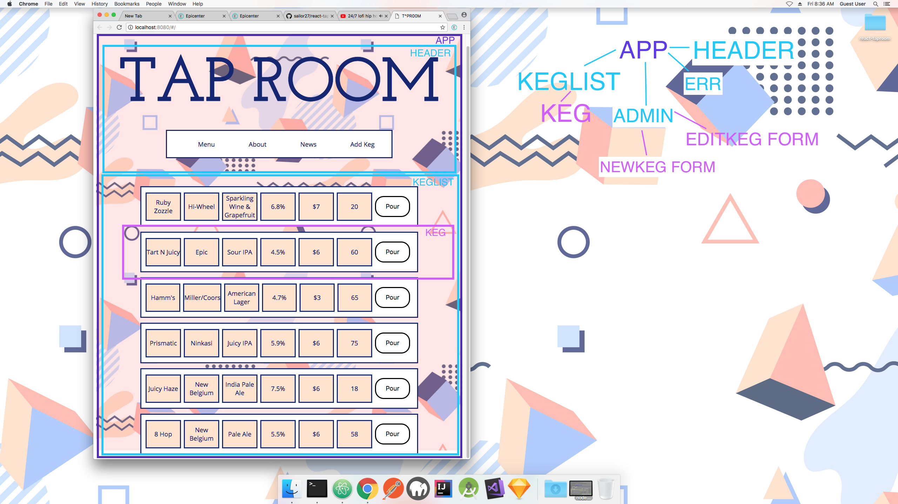

# **Tap Room** 🍻

## Project Description
The Tap Room is a dynamically updated application, which displays a menu of available beers to patrons, and allows employees to edit the menu and see additional details about the kegs.


This project rebuilds the the [Tap Room Angular2](https://github.com/sailor27/react-taproom.git) application using React.

## Built Using:

* Webpack
* Javacript
* React.js

## Installation Instructions
in the terminal:
```

npm install webpack@3.4.0 webpack-dev-server@2.5.0 eslint eslint-plugin-react -g

clone this repository
npm init
npm install
```

## Author
**Sailor Winkelman** - [GitHub](https://github.com/sailor27) | [LinkedIn](https://www.linkedin.com/in/sailor-winkelman-62429152)

## Component Tree Visual


## Issues/Bugs 🐛
* Form for Adding Kegs does not Require input on all fields
* Form for Editing Kegs foes not Require input on all fields
* Form for Editing Kegs requires user to _type all fields again_, not just what they are editing
* Background image does fill window on Admin view.
* KegList is not responsive or readable at smaller than 800 px.

## Features (as User Stories)
|  Implemented                                                                                                                 | Not Implemented                                                                                                                                                                                       |
|---------------------------------------------------------------------------------------------------------------------------------------|-------------------------------------------------------------------------------------------------------------------------------------------------------------------------------------------------------|
|  As a patron, I want to see a list/menu of all available kegs. For each keg, I need to see its name, brand, price and alcoholContent. | As an employee, I want to see how many pints are left in a keg. (Currently visible hard-coded on Admin)                                                                                               |
| As an employee, I want to fill out a form when I tap a new keg to add it to the list.                                                 | As a patron, I want to use the alcohol content property to display stronger beers differently than weaker beers                                                                                       |
| As an employee, I want the option to edit a keg's properties after entering them.                                                     | As an employee, I want to be able to click a button next to a keg whenever I sell a pint of it. This should decrease the number of pints left by 1                                                    |
|                                                                                                                                       | As an employee, I want to be able to see kegs with less than 10 pints left so I can be ready to change them.                                                                                          |
|                                                                                                                                       | As a patron, I want to have kegs prices to be color-coded for easy readability. Perhaps based on their price (greater or less than $5 per pint, perhaps) or the particular style of beer or kombucha. |
|                                                                                                                                       | As an employee, I want to be able to delete kegs from the menu.                                                                                                                                       |
## Future Styling Enhancements
* Add box shadows
* Hover color for a tags

## Development Notes

This section documents issues and questions  encountered during the development process.


| Issue 	| Notes 	| Resolution 	|
|-----------------------------------------------------------------------------	|-------------------------------------------------------------------------------------------------------------------------------------------------------------------------------------------------------------------------------------------------------------------------------------------------------------------------------------------	|---------------------------------------------------------------------------------------------------------------------------------------------------------	|
| Placement of Edit Keg in Component Tree 	| Making the tree, I was unsure where a component that edits an individual keg from the keg list would go. I eventually put it coming off of keg list, because that's where the data that would be modified by the user resides, but was unsure because I also imagined edit keg to be a dynamically routed page for each keg on the list.  	| I lifted state to APP when Admin component was created with children NewKeg and Edit Keg. Selecting a keg in Admin does not route to a detail page, it just shows form to edit that component at the top of admin page.	|
| RangeError: Maximum call stack size exceeded 	| keg list component is mapping masterKegList using Keg model and index. Something is causing an infinite loop! 	| accidentally declared: import Keg from './KegList'; on KegList. Resolved path and issue was resolved. 	|
| console error: Unknown props `global`, `jsx` on style tag in app component  	| This error started appearing when I added a style jsx tag with a global flag on App. It does not prevent the page from rendering, or the styles in the tag from appearing globally 	| resolved but unsure with what step 	|
| Unexpected character ' ? ' when importing images 	| This error happened when I imported an image from the assets folder. 	| I forgot to install url-loader and file-loader packages, and add rules to the webpack config for loading image files. Resolved after I did these steps. 	|
| Unable to use color variables inline or in css objects 	| It would be better if I could use the style jsx color variables throughout the app in all the styling methods, but currently can only in style jsx tags	|  Haven't found a way to do this.	|

## Acknowledgements

Background vector created by [SilviaNatalia - Freepik](https://www.freepik.com/free-photos-vectors/background)
